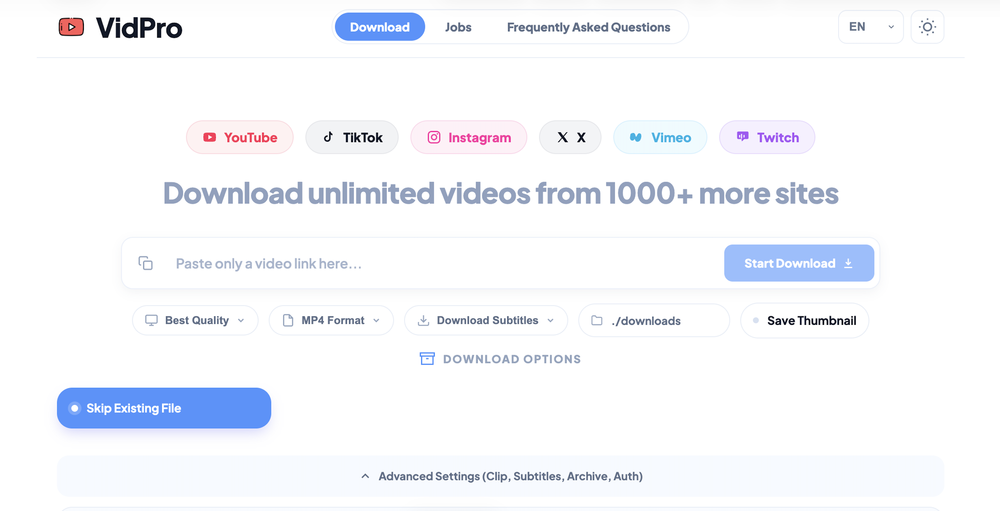

# VidPro v3.1 — Secure Multi-Site Video & Subtitle Downloader

A modern, secure media downloader built on `yt-dlp`, featuring a responsive Web UI, interactive CLI, encrypted cookie management, advanced security features, and smart domain-based folder organization.

<p align="center">
  
</p>

---

## 🚀 Quick Start

One command to install dependencies and launch the Web UI:

```bash
python3 run.py
```

`run.py` automatically:
- Creates a virtual environment (`venv`) if missing
- Installs all required Python packages including security libraries
- Checks for `ffmpeg` (prompts installation guide if missing)
- Sets up secure encryption keys for cookie protection
- Launches the Web UI → browser opens automatically at `http://127.0.0.1:8767`

---

## 🔒 Security & Privacy Features

### 🛡️ Advanced Cookie Security
- **Encrypted Cookie Storage**: All browser cookies are encrypted using AES-128 encryption
- **Secure Key Management**: Encryption keys stored in `.cookie_secret.key` with restricted permissions (600)
- **Automatic Cleanup**: Temporary decrypted files are securely deleted after use
- **Memory Safety**: Decrypted cookies only exist in memory during download operations

### 🔐 Input Validation & Protection
- **Path Traversal Protection**: Prevents access to sensitive files and directories
- **URL Validation**: Comprehensive validation of all input URLs with scheme checking
- **JSON Input Validation**: Secure parsing of all JSON inputs with type checking
- **Filename Sanitization**: Automatic sanitization of downloaded file names
- **CORS Protection**: Web UI restricted to localhost only with specific allowed origins

### 🚫 Security Hardening
- **No eval/exec**: Code execution vulnerabilities eliminated
- **Safe DOM Manipulation**: Web UI uses safe HTML templating
- **Error Handling**: Specific exception types prevent information leakage
- **Configuration Management**: Centralized, validated configuration system

---

## 🧩 Chrome Extension

You can find the secure browser extension in the `chrome-extension/` folder.

1. Open Chrome and go to `chrome://extensions/`.
2. Enable **Developer mode** (top right).
3. Click **Load unpacked** and select the `chrome-extension/` folder in this project.

**Extension Security Features:**
- **Manifest V3**: Modern, secure extension architecture
- **Minimum Permissions**: Only essential permissions (`activeTab`, `tabs`, `storage`)
- **Localhost Only**: Communicates exclusively with your local VidPro server
- **Safe Message Handling**: Validated communication between components

---

## ✨ Key Features

### 1. Multi-Site Support (yt-dlp powered)

- Supports **YouTube, Instagram, TikTok** and **1000+ additional sites** supported by `yt-dlp`.
- **Age-Restricted Content**: Automatically handles age verification using encrypted browser cookies
- Web preview is optimized for YouTube / Instagram / TikTok; downloading works for many other supported domains.

### 2. Smart Folder Organization

Downloads are auto-sorted into clean, domain-based directories:

- `downloads/YouTube/`
- `downloads/Instagram/`
- `downloads/TikTok/`
- `downloads/<OtherDomain>/` (for other supported sites)
- **Playlist-specific subfolders**: YouTube playlists are saved under their title (e.g., `downloads/YouTube/Favorite_List/`).

### 3. Advanced Web UI

- **Live Preview**: Paste a link → instantly see thumbnail, title, and channel info (YouTube & TikTok).
- **Progress Tracking**: Smooth animated progress bars + real-time download speed.
- **Playlist Management**: View all videos in a list, track status (✅ Completed, ⚠️ Skipped, ❌ Failed).
- **Smart Cleanup**: Filter and delete completed, failed, or skipped items from history.
- **Duplicate Detection**: Detects already-downloaded files and optionally skips them (with warning).
- **Theme Support**: Light/Dark mode for comfortable viewing.
- **Language Switcher**: Topbar language selector with **flag-only UI**, **English (default)** + 7 more languages.
- **Subtitle Controls**: Multi-select subtitle language list (default: English), subtitle format selection, embed subtitles, and only-subtitles mode.
- **Auth/Network Controls**: Encrypted cookies file, proxy, user-agent, referer, and custom headers (JSON).

### 4. Flexible Subtitle Workflow

- Download subtitles with multi-select language list (e.g. `en,tr,de`).
- Choose subtitle output format (`best`, `vtt`, `srt`, `ass`, `ttml`).
- Embed subtitles into video when compatible.
- Download **only subtitles** without downloading video/audio.
- If selected subtitle languages are not available, jobs are marked as **skipped** (instead of false error in only-subtitles scenarios).
- Jobs cards display subtitle metadata (requested/selected warning context).

### 5. Chrome Extension

- **One-Click Download**: Detects videos on the current tab and sends them to VidPro instantly.
- **Sync System**: Your browser cookie selection and other settings stay in sync between the Web UI and the Extension.
- **Live Status**: Monitor download progress directly from the extension popup.

### 6. Enhanced Auth & Restricted Content Support

- **Encrypted Cookie Caching**: Extracts cookies from your preferred browser (**Chrome, Opera, Safari, etc.**) and caches them securely with AES-128 encryption for **7 days** to minimize macOS Keychain prompts.
- **Age-Restriction Bypass**: Automatically handles "Sign in to confirm your age" blocks by using your encrypted logged-in browser session.
- **Manual Cookies**: Still supports standard `cookies.txt` files with validation.
- **Network Tools**: Custom `User-Agent`, `Referer`, `Proxy`, and extra HTTP headers.

### 7. Configuration Management

- **Centralized Config**: All settings in `config.json` with validation
- **Security Settings**: CORS origins, allowed methods, encryption toggles
- **Default Values**: Quality, format, paths, and feature flags
- **Runtime Validation**: Configuration validated on startup

### 8. Localization

- UI localization files are under `static/lang/`.
- Included languages:
  - `static/lang/en.json`
  - `static/lang/tr.json`
  - `static/lang/es.json`
  - `static/lang/de.json`
  - `static/lang/fr.json`
  - `static/lang/it.json`
  - `static/lang/pt.json`
  - `static/lang/ru.json`
- Default language is English; selection is saved in browser `localStorage`.
- FAQ content is localized per language file.

---

## 🛠 Usage Modes

### 1. Web UI (Recommended)

```bash
python3 run.py
# or
python yt_downloader.py --web
```

### 2. Interactive CLI (Arrow-key navigation)

```bash
python yt_downloader.py
```

Navigate menus with arrow keys and select options interactively.

### 3. Standard CLI

```bash
python yt_downloader.py <URL> [options]
```

---

## ⚙️ Configuration

### Security Configuration

Edit `config.json` to customize security settings:

```json
{
  "security": {
    "allowed_origins": ["http://127.0.0.1:8767", "http://localhost:8767"],
    "allowed_methods": ["GET", "POST", "PUT", "DELETE"],
    "encrypt_cookies": true
  },
  "features": {
    "auto_cleanup_temp": true,
    "encrypt_cookies": true
  }
}
```

### All CLI Options

| Option                 | Default         | Description                                                                 |
|------------------------|------------------|-----------------------------------------------------------------------------|
| `--web`                | —                | Launch Web UI (port: 8767)                                                  |
| `--history`            | —                | Show download history                                                       |
| `--history-file FILE`  | `archive.txt`    | History/archive file path                                                   |
| `-o, --output DIR`     | `./downloads`    | Base download directory                                                     |
| `-q, --quality`        | `best`           | Video quality preset (`best/4k/1080/720/480/360`)                            |
| `--out-format`         | `mp4`            | Output container (`mp4/mkv/webm`)                                            |
| `-f, --format FORMAT_ID` | —              | Explicit yt-dlp format selector                                             |
| `--audio`              | —                | Download audio only (MP3, 192kbps)                                          |
| `--subtitle`           | —                | Enable subtitle download                                                    |
| `--subtitle-langs DILLER` | `en`          | Subtitle languages (comma-separated, e.g. `en,tr,de`)                       |
| `--subtitle-format FORMAT` | `best`       | Subtitle format (`best/vtt/srt/ass/ttml`)                                   |
| `--embed-subs`         | —                | Embed subtitles into video (when compatible)                                |
| `--only-subs`          | —                | Download only subtitles (skip media download)                               |
| `--thumbnail`          | —                | Save thumbnail image                                                        |
| `--metadata`           | —                | Save video metadata as JSON                                                 |
| `--no-overwrite`       | —                | Skip if file exists (UI shows warning)                                      |
| `--archive FILE`       | —                | Use archive file to avoid re-downloading                                    |
| `--clip START END`     | —                | Download specific segment (e.g., `00:01:00 00:02:30`)                        |
| `--playlist`           | —                | Download entire playlist                                                    |
| `--playlist-start N`   | —                | Playlist start index                                                        |
| `--playlist-end N`     | —                | Playlist end index                                                          |
| `--list-formats`       | —                | List available formats for given URL                                        |
| `--cookies FILE`       | —                | Cookies file path (Netscape format)                                         |
| `--proxy URL`          | —                | Proxy URL (HTTP/SOCKS)                                                      |
| `--user-agent UA`      | —                | Custom User-Agent header                                                    |
| `--referer URL`        | —                | Custom Referer header                                                       |
| `--headers-json JSON`  | —                | Extra headers as JSON object                                                |
| `--batch-file FILE`    | —                | Read batch of URLs from file                                                |
| `--concurrent N`       | `1`              | Parallel downloads for batch mode                                           |

---

## 📝 Requirements

- **Python 3.8+**
- **ffmpeg**: Required for video/audio processing (must be installed system-wide).
- **cryptography**: For secure cookie encryption (auto-installed)
- **Internet connection**: To fetch and download media.

---

## 📂 Sample Directory Structure

```text
vidpro/
├── downloads/
│   ├── YouTube/
│   │   └── Music_Playlist/
│   │       ├── video1.mp4
│   │       └── video2.mp4
│   ├── Instagram/
│   │   └── reel_video.mp4
│   └── TikTok/
│       └── tiktok_trend.mp4
│   └── Twitter/
│       └── post_video.mp4
├── cookies_cache/
│   └── chrome_cookies.txt.enc  # Encrypted cookie file
├── config.json                  # Configuration file
├── .cookie_secret.key          # Encryption key (600 permissions)
└── validation.py               # Input validation utilities
```

---

## 🔧 Security Architecture

### Cookie Encryption Flow

1. **Extraction**: Browser cookies extracted using yt-dlp
2. **Encryption**: Cookies encrypted with AES-128 using Fernet
3. **Storage**: Encrypted file saved as `browser_cookies.txt.enc`
4. **Usage**: Temporary decryption to secure temp file during download
5. **Cleanup**: Temp file securely deleted after use

### Input Validation

All user inputs are validated through `validation.py`:
- URL validation with scheme checking
- File path validation with traversal protection
- JSON input validation with type checking
- Filename sanitization for filesystem safety

### Web Security

- **CORS**: Restricted to localhost origins only
- **Headers**: Content Security Policy enforced
- **Validation**: All form inputs validated server-side
- **Error Handling**: Specific exceptions prevent information leakage

---

## 📜 License

This project is licensed under the **MIT License**.  
See [LICENSE](LICENSE).

---

> 💡 **Note**: This tool is for personal/fair-use downloading only. Respect creators' rights and platform terms of service.
> 
> 🔒 **Privacy**: All cookies are encrypted locally and never transmitted. No data is sent to external servers.
> 
> 🛡️ **Security**: This application includes comprehensive security features including input validation, encrypted storage, and secure communication protocols.